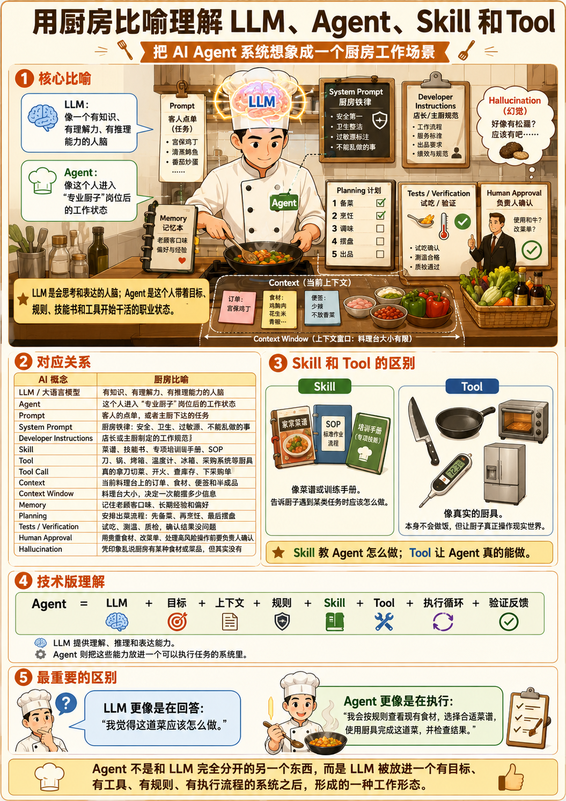
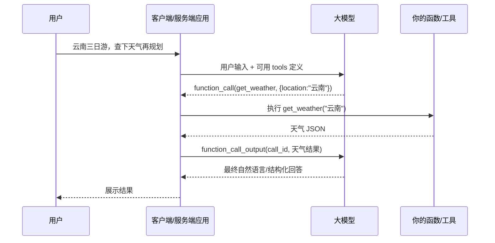

## 一、基础名词/概念

什么是 Agent （智能体）呢？一言以蔽之，它是一个可以帮我们**真正干活的 AI**。平时所用的那些大语言模型，也就是前几年的那些纯聊天 AI，这些产品原先只能语言文字类的输入输出，只能跟我们用文件一问一答地交流，他们都不能够像一个人一样帮我们干活（ps：目前的chatgpt、cluade、deepseek等Chat-AI其实已经算是agent了，因为可以帮我们搜索、读取文件修改文件以及自动化）。试想一下，如果你想让一个 AI 帮你点一份外卖，或者根据你的身份，每逢节假日自动给亲朋好友发送祝福，这些普通聊天式AI 都是无法实现的。直到 **openclaw**（龙虾）在国内大火之后，人们开始意识到原来有这样一个东西是可以真正帮我们操作文件，写代码，改 PPT，执行各种具体的操作，于是Agent 这个概念逐渐进入到大众的视野。

如果举个更形象的比喻，用厨房工作场景来比喻理解 LLM、Agent、Skill 和 Tool：

> **LLM 像一个有知识、有理解力、有推理能力的人脑。**

它知道很多东西，能理解需求，也能推理和表达。比如它知道一道菜大概怎么做、什么食材可以搭配、什么步骤可能出错。但它默认更像是在“想”和“说”，不一定真的进入厨房完成整套工作。

> **Agent 像这个人进入某个职业岗位后的工作状态。**

当这个“有大脑的人”被赋予目标、规则、上下文、工具和执行流程后，他就不只是回答问题，而是开始像一个专业厨子一样接单、规划、动手、检查结果，并交付成品。

> **LLM 是会思考和表达的人脑；Agent 是这个人带着目标、规则、技能书和工具开始干活的职业状态。**



对应关系：

| AI 概念                | 厨房比喻                                         |
| ---------------------- | ------------------------------------------------ |
| LLM / 大语言模型       | 有知识、有理解力、有推理能力的人脑               |
| Agent                  | 这个人进入“专业厨子”岗位后的工作状态             |
| Prompt                 | 客人的点单，或者主厨下达的任务                   |
| System Prompt          | 厨房铁律：安全、卫生、过敏源、不能乱做的事       |
| Developer Instructions | 店长或主厨制定的工作规范                         |
| Skill                  | 菜谱、技能书、专项培训手册、SOP                  |
| Tool                   | 刀、锅、烤箱、温度计、冰箱、采购系统等厨具       |
| Tool Call              | 真的拿刀切菜、开火、查库存、下采购单             |
| Context                | 当前料理台上的订单、食材、便签和半成品           |
| Context Window         | 料理台大小，决定一次能摆多少信息                 |
| Memory                 | 记住老顾客口味、长期经验和偏好                   |
| Planning               | 安排出菜流程：先备菜、再烹饪、最后摆盘           |
| Tests / Verification   | 试吃、测温、质检，确认结果没问题                 |
| Human-in-the-loop      | 用贵重食材、改菜单、处理高风险操作前要负责人确认 |

下面我们用一个公式来解释一下agent是什么：

```ts
Agent = LLM + Harness + Tools + Context/Memory + Guardrails + Human Approval + Observability+...
```

这公式看着很长，而且后面还可以加入很多东西，但它其实可以简化一下：

```ts
Agent = LLM + Harness;
```

也就是说，除了**大语言模型(LLM)**之外的所有的框架、所有的思想、所有的技术、所有的代码，都可以归纳为一个词： **Harness**。那Harness 它是一个具体的东西吗？其实它并不是一个具体的一个框架，也不是具体一个开发语言，也不是某项技术栈。它是一种工程思想，直译就是**驾驭工程**。

我们知道LLM 是基于上下文进行统计生成的系统，它不天然保证事实正确、动作安全或符合业务规则。平时文字类的输出错了也就罢了，起码我们还是具有判断力的，但是如果 Agent 执行了LLM 发出的错误指令，那它有可能会造成把电脑上所有文件全部清空的这种严重的后果。所以我们要给它套上一个**马具（harness）**来约束LLM输出结果使他达到我们满意的效果，其实非常形象，就是防止马儿乱跑，给它套上马具来控制它的方向。所以我们用这种思想下设计的所有的技术、所有的代码都可以称为 harness。

不少工程师会这样类比：

> **模型是 CPU，上下文窗口是 RAM，Harness 是操作系统，Agent 是应用程序。**

想要使用一个应用程序光有cpu是不行的，你还需要一个操作系统来管理资源、调度任务、处理异常。

如果用更规范的语句来总结 Agent 的话，那就是一类**以目标为中心、可在循环中规划与执行、能够调用外部工具，并保留足够状态以完成多步任务的软件系统**。Harness 的核心思想是：**模型负责提出可能性，系统负责约束、验证、编排和落地**。Anthropic 将其与更确定性的 workflow 区分开来；OpenAI、LangChain、Google 等则把它工程化为运行时、状态、工具、记忆、可观测、评测等可组合部件。

在正式学习如何完成一个 Agent 的开发之前，我们先需要进行一些基础概念名词的科普，有助于帮助我们更好的理解在开发过程中的一些设计与思想:

1. [**LLM**大语言模型 & **prompt** 提示词工程](./1、LLM大语言模型%20&%20prompt提示词工程.md)
2. [**context** 上下文](./2、context上下文.md)
3. [**Function** & **Function calling** & **Tool**](./3、Function%20&%20Function%20calling%20&%20Tool.md)
4. [**SKILL**技能 & **MCP** & 插件](./4、SKILL技能%20&%20MCP%20&%20插件.md)
5. [**router** 路由](./5、router路由.md)
6. [**ReAct loop** 循环](./6、ReAct%20loop循环.md)
7. [**harness**驾驭工程](./7、harness驾驭工程.md)
8. [**RAG** 检索增强技术](./8、RAG检索增强技术.md)
9. [**Langgraph & langchain**](./9、Langgraph%20&%20langchain.md)
10. [**Workflow**](./10、Workflow.md)
11. [（**Session** 会话 & **Storage**持久化 & **Memory**记忆） 辨析](./11、Session会话%20&%20Storage持久化%20&%20Memory记忆辨析.md)
12. [Sandbox 沙盒](./12、Sandbox沙盒.md)
13. [**trace** 追踪痕迹](./13、trace追踪痕迹.md)
14. [**Orchestrator** 编排器](./14、Orchestrator编排器.md)
15. [**Planner** 规划器](./15、Planner规划器.md)
16. [**Executor** 执行器](./16、Executor执行器.md)
17. [**Runtime** 运行时](./17、Runtime运行时.md)
18. [State状态](./18、State状态.md)
19. [**Checkpointing** 检查点](./19、Checkpointing检查点.md)
20. [**Middleware** 中间件](./20、Middleware中间件.md)
21. [**Agent**分类](./21、Agent分类.md)
22. [**A2A**(Agent-to-Agent 协议) & MCP & Plugin 插件](./22、A2A(Agent-to-Agent协议)%20&%20MCP%20&%20Plugin插件.md)
23. [Human-in-the-loop / Approval Gate](./23、Human-in-the-loop%20&%20Approval%20Gate.md)
24. [Structured Output / Schema](./24、Structured%20Output%20&%20Schema.md)
25. [Idempotency](./25、Idempotency.md)
26. [Interrupt / Resume](./26、Interrupt%20&%20Resume.md)
27. [token](./27、Token.md)
28. [**Loop Engineering** 循环工程](./28、Loop%20Engineering循环工程.md)

```
1. Agent 是什么
2. Model / LLM / Multimodal Model
3. Prompt / Instructions / Context
4. Structured Output / Schema
5. Tool / Function Calling
6. Harness / Runtime / Runner
7. Agent Loop / ReAct
8. State / Session / Memory / Storage
9. Skill / Router / Planner / Executor
10. Workflow / LangGraph / Orchestrator
11. RAG / Grounding / Provenance
12. Guardrails / Policy / Approval / Sandbox
13. Observability: Trace / Logs / Audit / Usage
14. Eval / Red Teaming
```

## 二、Agent架构设计


