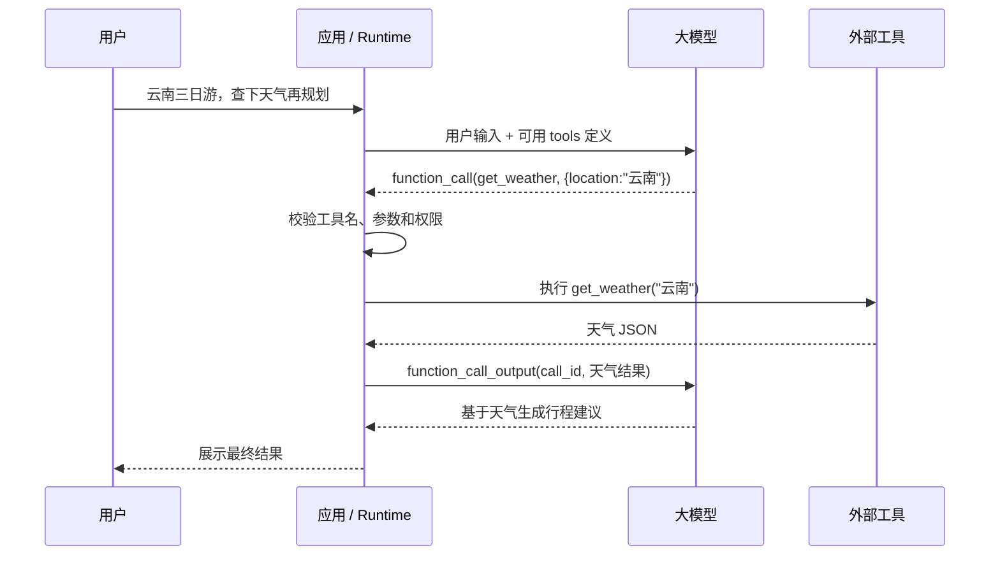

# Function、Function Calling 与 Tool

[返回 Agent 开发笔记合集](./0、agent-dev-notes.md)

## 1、定义

Tool 是 Agent 可以调用的外部能力。它可以查询天气、读取文件、运行测试、搜索网页、访问数据库，也可以调用另一个服务。

Function 通常指一种由程序定义的工具。它有名称、说明、参数结构和返回结果，常用 JSON Schema 描述输入。

Function Calling，也叫 Tool Calling，是模型请求调用工具的协议机制。模型不是自己执行函数，而是生成“我想调用哪个工具、参数是什么”的结构化请求。

真正执行工具的是你的应用、Runtime 或 Harness。模型负责提出调用意图，系统负责校验、执行、记录和把结果送回模型。

## 2、为什么它重要

没有工具调用，LLM 主要只能生成文本。它可以建议你“查天气”，但不能真的查；可以说“运行测试”，但不能真的运行。

Tool Calling 让 Agent 从“会说”变成“会做”。它把模型连接到外部世界，让模型能读取实时数据、执行任务和产生可验证结果。

但工具越强，风险越高。读文件、写数据库、发消息、付款、删除资源这类工具必须被权限、Schema、审批和审计约束。

## 3、一次完整调用链路



关键点是：模型并没有直接访问天气 API。它只是请求调用，真正的执行权在系统手里。

## 4、Tool 的常见分类

| 类型 | 说明 |
| --- | --- |
| Function Tool | 你自己定义的函数，通常有 JSON Schema 参数 |
| Built-in Tool | 平台内置工具，比如搜索、代码执行、文件解析 |
| MCP Tool | 来自 MCP Server 的工具，由外部服务暴露 |
| Custom Tool | 输入输出更自由的工具，适合复杂文本或非标准协议 |
| Human Tool | 把某一步交给人确认或补充信息 |

可以这样理解：

```text
Tool = Agent 能使用的外部能力
Function = Tool 的一种常见实现形式
Function Calling = 模型请求使用 Tool 的机制
```

## 5、一个代码结构例子

```ts
{
  type: "function",
  name: "get_weather",
  description: "查询某个地点的天气",
  strict: true,
  parameters: {
    type: "object",
    properties: {
      location: {
        type: "string",
        description: "城市或地点名"
      }
    },
    required: ["location"],
    additionalProperties: false
  }
}
```

模型可能返回：

```json
{
  "type": "function_call",
  "call_id": "call_abc123",
  "name": "get_weather",
  "arguments": "{\"location\":\"昆明\"}"
}
```

系统执行后，再把结果回传给模型：

```json
{
  "type": "function_call_output",
  "call_id": "call_abc123",
  "output": "{\"temperature\":25,\"condition\":\"晴\"}"
}
```

## 6、常见误区

### 误区一：模型调用了函数，所以函数是在模型里执行的

不是。模型只生成调用请求。函数执行发生在你的应用、服务端或 Agent Runtime 里。

### 误区二：工具说明写清楚就足够安全

不够。工具必须做参数校验、权限检查、超时处理、错误处理和审计记录。

### 误区三：所有能力都应该做成工具

不是。工具越多，路由和选择越难。高频、明确、可验证的能力更适合工具化。

### 误区四：工具返回自然语言就够了

很多场景下不够。工具结果最好结构化，方便模型引用，也方便系统验证和记录。

## 7、一句话总结

Tool 让 Agent 能真正连接外部世界；Function 是工具的一种结构化形式；Function Calling 是模型请求使用工具的协议。

## 参考资料

- [OpenAI: Function calling](https://platform.openai.com/docs/guides/function-calling)
- [Anthropic: Tool use](https://docs.anthropic.com/en/docs/agents-and-tools/tool-use/overview)
- [Model Context Protocol Documentation](https://modelcontextprotocol.io/docs)
