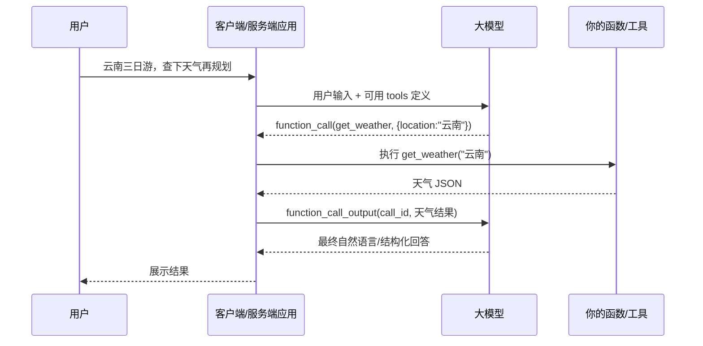

## **Function calling** & **Tool** 

### 1、名词解释

- **Tool**：我们把一些具体的函数组成的能够真实操作文件等的功能叫做tool，他是LLM能够帮我们干活操作设备的能力本身。

- **Function calling**：也叫 tool calling，它让模型和外部系统交互，访问训练数据之外的数据或动作，是 LLM API 里的工具调用协议模式。顾名思义就是“我要叫一次function/tool”。

- **Function：**按照openai官方的定义，function 是 tool 的一种，通常由 JSON Schema 定义。此外还有 custom tools 和 OpenAI built-in tools，比如 web search、code interpreter、MCP 等。

- ```
  Tool 工具 / 能力
    ├─ Function tool：你自己定义的函数，JSON schema 入参
    ├─ Built-in tool：OpenAI 平台内置，如 web_search、code interpreter
    ├─ MCP tool：来自 MCP server 的工具
    └─ Custom tool：自由文本输入输出的工具
  
  Function calling
    = 模型选择调用 function tool 的机制
  ```

  

### 2、完整的Function callling 路径

一次典型的LLM对tool的请求，例如一名用户需要让LLM查询下某地的天气，然后整条链路的逻辑是这样的：



### 3、代码细节

```ts
// 1. Tool / Function Definition：你暴露给模型的函数说明（并非真正要执行的函数代码块）
{
  type: "function",
  name: "get_weather",
  description: "查询某个地点的天气",
  strict: true,
  parameters: {
    type: "object",
    properties: {
      location: {
        type: "string",
        description: "城市或地点名"
      }
    },
    required: ["location"],
    additionalProperties: false
  }
}
// 2. Model Tool Call：模型返回“我想调用这个函数”
{
  type: "function_call",
  call_id: "call_abc123",
  name: "get_weather",
  arguments: "{\"location\":\"昆明\"}"
}
// 3. Tool Output：你的程序真正执行函数后，把结果回传给模型
{
  type: "function_call_output",
  call_id: "call_abc123",
  output: "{\"temperature\":25,\"condition\":\"晴\"}"
}
// 4. Final Response：模型拿到工具结果后，生成最终回答
"昆明今天约 25 度，天气晴，适合安排滇池和翠湖这类户外行程。"
```

