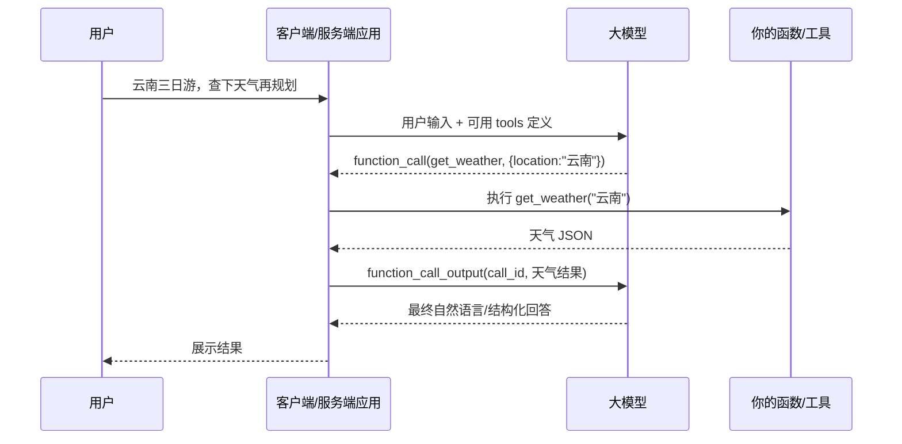

## **Function** & **Function calling** & **Tool** 

1、

### 2、完整的Function callling 路径

一次典型的LLM对tool的请求，例如一名用户需要让LLM查询下某地的天气，然后整条链路的逻辑是这样的：

```mermaid
sequenceDiagram
  participant U as 用户
  participant App as 客户端/服务端应用
  participant M as 大模型
  participant Tool as 你的函数/工具

  U->>App: 云南三日游，查下天气再规划
  App->>M: 用户输入 + 可用 tools 定义
  M-->>App: function_call(get_weather, {location:"云南"})
  App->>Tool: 执行 get_weather("云南")
  Tool-->>App: 天气 JSON
  App->>M: function_call_output(call_id, 天气结果)
  M-->>App: 最终自然语言/结构化回答
  App-->>U: 展示结果
```